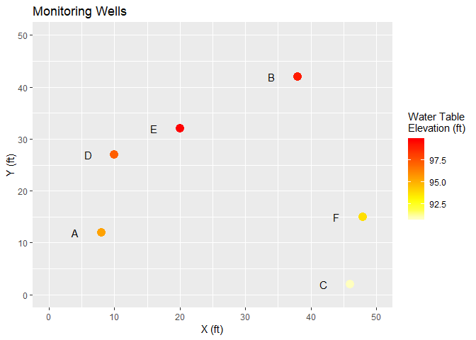
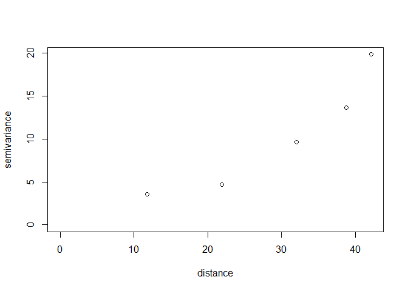
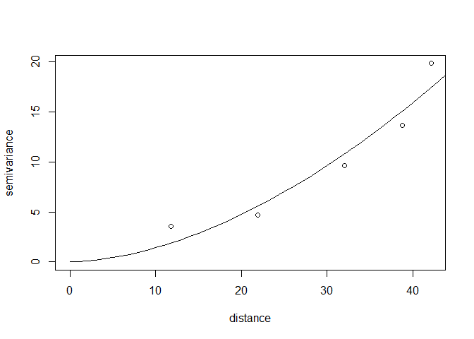

Groundwater Interpolation: 4 Methods
================
Andrea J. Elhajj
6/5/2019

## Introduction

On July 7, 2018, my team and I measured the depths of water at six
monitoring wells at a private, non-disclosed site. We are interested in
interpolating the water table elevations utilizing the following four
methods:

1.  Inverse distance weighting
2.  First-order (planar) polynomial
3.  Second-order (quadratic) polynomial
4.  Kriging

These wells are located using X and Y coordinates. The data log also
contains the elevation to the top of the casing (ft) and the depth to
the water below the top of this casing:

``` r
library(readr)
library(ggplot2)
```

    ## Registered S3 methods overwritten by 'ggplot2':
    ##   method         from 
    ##   [.quosures     rlang
    ##   c.quosures     rlang
    ##   print.quosures rlang

``` r
library(dplyr)
```

    ## 
    ## Attaching package: 'dplyr'

    ## The following objects are masked from 'package:stats':
    ## 
    ##     filter, lag

    ## The following objects are masked from 'package:base':
    ## 
    ##     intersect, setdiff, setequal, union

``` r
library(fields)
```

    ## Loading required package: spam

    ## Loading required package: dotCall64

    ## Loading required package: grid

    ## Spam version 2.2-2 (2019-03-07) is loaded.
    ## Type 'help( Spam)' or 'demo( spam)' for a short introduction 
    ## and overview of this package.
    ## Help for individual functions is also obtained by adding the
    ## suffix '.spam' to the function name, e.g. 'help( chol.spam)'.

    ## 
    ## Attaching package: 'spam'

    ## The following objects are masked from 'package:base':
    ## 
    ##     backsolve, forwardsolve

    ## Loading required package: maps

    ## See https://github.com/NCAR/Fields for
    ##  an extensive vignette, other supplements and source code

``` r
library(sp)
library(geoR)
```

    ## --------------------------------------------------------------
    ##  Analysis of Geostatistical Data
    ##  For an Introduction to geoR go to http://www.leg.ufpr.br/geoR
    ##  geoR version 1.7-5.2.1 (built on 2016-05-02) is now loaded
    ## --------------------------------------------------------------

``` r
library(reshape2)

df <- readr::read_csv("Well.Data.csv")
```

    ## Parsed with column specification:
    ## cols(
    ##   `Well ID` = col_character(),
    ##   X = col_double(),
    ##   Y = col_double(),
    ##   `Top of Casing Elevation (ft)` = col_double(),
    ##   `Depth to Water Below TOC (ft)` = col_double()
    ## )

``` r
head(df)
```

    ## # A tibble: 6 x 5
    ##   `Well ID`     X     Y `Top of Casing Elevation~ `Depth to Water Below TO~
    ##   <chr>     <dbl> <dbl>                     <dbl>                     <dbl>
    ## 1 A             8    12                     101                         5.6
    ## 2 B            38    42                     101.                        2.3
    ## 3 C            46     2                      99.1                       8.1
    ## 4 D            10    27                     100.                        3.2
    ## 5 E            20    32                     101.                        1.5
    ## 6 F            48    15                     100.                        6.7

We will begin by calculating the water table elevations (Z) by
subtracting the depth to the water below from the top of the casing:

``` r
df <- df %>%
  mutate(Z = `Top of Casing Elevation (ft)`-`Depth to Water Below TOC (ft)`) %>%
  select(`Well ID`, X, Y, Z)
```

Next, we will visualize this data by creating a simple plot of the site
and well locations:

``` r
ggplot(df, aes(df$X, df$Y, col = df$Z)) + 
  geom_point(size = 4) + 
  geom_text(label = df$`Well ID`, nudge_x = -4, color = "black") +
  scale_colour_gradientn(colours = heat.colors(10, rev = TRUE)) +
  xlim(0, 50) +
  ylim(0, 50) +
  labs(x = "X (ft)", 
       y = "Y (ft)",
       title = "Monitoring Wells",
       col = "Water Table\nElevation (ft)")
```

<!-- -->

These interpolations will occur over the entire 50 ft x 50 ft plot of
land. A 50 x 50 matrix (predicted.z) will be created to represent all of
these target points and store the predictd water table elevations:

``` r
predicted.x <- seq(1,50,1)
predicted.y <- seq(1,50,1)
predicted.z <- matrix(0, 50, 50)
```

## Inverse Distance Weighting

We will calculate the Euclidean distances from every target point to
each of the 6 known control points. Using these Euclidean distances and
the formula for average distanced weighting, we will calculate the
predicted water table elevation:

``` r
for (j in 1:50) {
  for (i in 1:50) {
    dist.1 <- sqrt((df$X[1]-predicted.x[i])^2 + (df$Y[1]-predicted.y[j])^2)
    dist.2 <- sqrt((df$X[2]-predicted.x[i])^2 + (df$Y[2]-predicted.y[j])^2)
    dist.3 <- sqrt((df$X[3]-predicted.x[i])^2 + (df$Y[3]-predicted.y[j])^2)
    dist.4 <- sqrt((df$X[4]-predicted.x[i])^2 + (df$Y[4]-predicted.y[j])^2)
    dist.5 <- sqrt((df$X[5]-predicted.x[i])^2 + (df$Y[5]-predicted.y[j])^2)
    dist.6 <- sqrt((df$X[6]-predicted.x[i])^2 + (df$Y[6]-predicted.y[j])^2)
    predicted.z[i,j] <- (df$Z[1]/dist.1 + df$Z[2]/dist.2 + df$Z[3]/dist.3 + df$Z[4]/dist.4 + df$Z[5]/dist.5 + df$Z[6]/dist.6)/(1.0/dist.1 + 1.0/dist.2 + 1.0/dist.3 + 1.0/dist.4 + 1.0/dist.5 + 1.0/dist.6)
#for those target points very close to the control points, substitute the field-measured Z value:
    if (dist.1 <= 0.00001) predicted.z[i,j] <- df$Z[1]  
    if (dist.2 <= 0.00001) predicted.z[i,j] <- df$Z[2]
    if (dist.3 <= 0.00001) predicted.z[i,j] <- df$Z[3]
    if (dist.4 <= 0.00001) predicted.z[i,j] <- df$Z[4]
    if (dist.5 <= 0.00001) predicted.z[i,j] <- df$Z[5]
    if (dist.6 <= 0.00001) predicted.z[i,j] <- df$Z[6]
    }
}
```

Now, we can convert this interpolation matrix into a molten data frame
and visualize it:

``` r
predicted.z.melt <- melt(predicted.z)

ggplot(data=predicted.z.melt, aes(x=Var1, y=Var2, z = value, fill=value)) + 
  geom_tile() + 
  scale_fill_gradientn(colours = heat.colors(10, rev = TRUE)) + 
  geom_contour(colour = "black") +
  xlim(0, 50) +
  ylim(0, 50) +
  labs(x = "X (ft)", 
       y = "Y (ft)",
       title = "Inverse Distance Weighting Interpolation",
       fill = "Water Table\nElevation (ft)")
```

<!-- -->

## First-Order (Planar) Polynomial

We are now interested in comparing this method to a first-order (planar)
polynomial. We will use the function lm() to fit a linear model to the
raw data. Then, we will use this linear model to predict the Z values
for all combinations of X and Y coordinates:

``` r
x <- df$X
y <- df$Y
z <- df$Z
target_coords <- list(x = predicted.x,y = predicted.y)
z.planar <- lm(z ~ x + y)
pred.z.lm <- predict.lm(z.planar, newdata=expand.grid(target_coords))
pred.z.lm <- matrix(pred.z.lm, 50, 50)
```

And just as before, we will convert this interpolation matrix into a
molten data frame and visualize it:

``` r
z.lm.melt <- melt(pred.z.lm)

ggplot(data = z.lm.melt, aes(x=Var1, y=Var2, z = value, fill = value)) + 
  geom_tile() + 
  scale_fill_gradientn(colours = heat.colors(5, rev = TRUE)) + 
  geom_contour(colour = "black") +
  xlim(0, 50) +
  ylim(0, 50) +
  labs(x = "X (ft)", 
       y = "Y (ft)",
       title = "First-Order (Planar) Polynomial Interpolation",
       fill = "Water Table\nElevation (ft)")
```

<!-- -->
This method produced an interpolation in which the contours are simply
flat (planar) lines, while the distance-weighted average method allowed
for nuances in the groundwater hydrology.

## Second-Order (Quadratic) Polynomial

Let’s see if this planar interpolation can be improved by using a
second-order (quadratic) polynomial instead:

``` r
z.quad <- lm(z ~ x * y + I(x^2) + I(y^2))
pred.z.quad <- predict.lm(z.quad, newdata=expand.grid(target_coords))
pred.z.quad <- matrix(pred.z.quad, 50, 50)


z.quad.melt <- melt(pred.z.quad)

ggplot(data = z.quad.melt, aes(x=Var1, y=Var2, z = value, fill = value)) + 
  geom_tile() + 
  scale_fill_gradientn(colours = heat.colors(5, rev = TRUE)) + 
  geom_contour(colour = "black") +
  xlim(0, 50) +
  ylim(0, 50) +
  labs(x = "X (ft)", 
       y = "Y (ft)",
       title = "Second-Order (Quadratic) Polynomial Interpolation",
       fill = "Water Table\nElevation (ft)")
```

<!-- -->

As shown above, the second-order polynomial results in contour lines
that are conical in shape.

## Kriging

Kriging is an interpolation method that is based on spatial
autocorrelation (closer things are more predictable and have less
variability, while distant things are less predictable and are less
related). Kriging has the capability of producing not only a prediction
surface, but also providing some measure of the accuracy of the
predictions.

Kriging is a multistep process that includes variogram modeling,
creating the surface, and exploring a variance surface.

We will begin by creating a theoretical semi-variogram. A semi-variogram
takes 2 sample locations and plots the Euclidean distance between these
points on the x-axis. The variance between the response variable (in
this case, water table elevation) is plotted on the y-axis:

``` r
coordinates(df) = ~X + Y
df <- df[-c(1)]
geo_data <- as.geodata(df)
bin1 <- variog(geo_data) # Return binned results
```

    ## variog: computing omnidirectional variogram

``` r
plot(bin1)
```

<!-- -->

As expected, when distance increases between a pair of points, the
semivariance increases (hence less correlation). Fitting a model to the
spatial structure shown in the semi-variogram will allow us to create a
Kriged interpolated image.

We will fit this semi-variogram with a power function:

``` r
plot(bin1)
lines.variomodel(cov.model="power", cov.pars=c(0.025,1.75), nug = 0, max.dist = 100)
```

<!-- -->

We will apply this power model over the entire 50 ft x 50 ft grid and
then visualize the interpolation surface:

``` r
pred.grid <-  expand.grid(target_coords)
kc <- krige.conv(geo_data, loc = pred.grid, krige = krige.control(cov.model="power",
      cov.pars=c(0.025,1.75), nug = 0))
```

    ## krige.conv: model with constant mean
    ## krige.conv: Kriging performed using global neighbourhood

``` r
kc.predict <- kc$predict
kc.predict <- matrix(kc.predict, 50, 50)
z.krige.melt <- melt(kc.predict)
ggplot(data = z.krige.melt, aes(x=Var1, y=Var2, z = value, fill = value)) + 
  geom_tile() + 
  scale_fill_gradientn(colours = heat.colors(5, rev = TRUE)) + 
  geom_contour(colour = "black") +
  xlim(0, 50) +
  ylim(0, 50) +
  labs(x = "X (ft)", 
       y = "Y (ft)",
       title = "Kriging Interpolation",
       fill = "Water Table\nElevation (ft)")
```

<!-- -->

Interestingly enough, it appears that this Kriged image most closely
matches the first order (planar) polynomial interpolation. Because this
is a highly advanced interpolation technique, we are the most confident
in this theoretical prediction of the water table elevations.

We can also easily examine a visualization of the variance:

``` r
kc.variance <- kc$krige.var
kc.variance <- matrix(kc.variance, 50, 50)
z.var.melt <- melt(kc.variance)
ggplot(data = z.var.melt, aes(x=Var1, y=Var2, z = value, fill = value)) + 
  geom_tile() + 
  scale_fill_gradientn(colours = topo.colors(5, rev = TRUE)) + 
  geom_contour(colour = "black") +
  xlim(0, 50) +
  ylim(0, 50) +
  labs(x = "X (ft)", 
       y = "Y (ft)",
       title = "Kriging Variance",
       fill = "Variance")
```

<!-- -->

This plot shows a zone of low variance where data points are known.

## Conclusion

In order to further enhance the accuracy of the theoretical groundwater
interpolation, my team is preparing another site visit. Budget
constraints do not allow for additional drilling, but other visual clues
will be observed. For instance, the presence of water-loving plants
indicate that the groundwater at that specific location of growth is
between moderate to shallow. Other obvious clues would be to note where
water is at the surface, either in the form of springs, swamps, seepage,
or lakes.

Geologic maps or cross sections of the site would be invaluable as
knowledge of the subsurface lithography (both rock type and any large
cracks or openings) would enable educated guesses of favorable and
unfavorable conditions for groundwater development.
